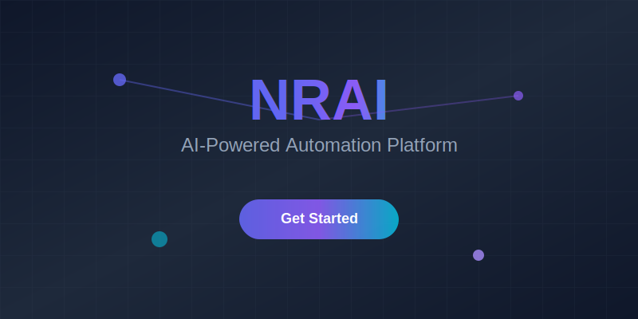

<div className="nrai-hero-section">
  <div className="nrai-hero-content">
    <h1 className="nrai-gradient-text">Transform Your World with NRAI</h1>
    <p className="nrai-hero-subtitle">
      Experience the next evolution of automation technology. NRAI empowers you to create intelligent, 
      adaptive workflows that think, learn, and evolve with your business needs.
    </p>
  </div>
</div>

## 🚀 Why NRAI Changes Everything

NRAI isn't just another automation platform—it's a paradigm shift. Built from the ground up with AI-first principles, 
it transforms how you think about connecting systems, processing data, and scaling operations.

<CardGroup cols={2}>
  <Card title="🧠 AI-Native Architecture" icon="brain" color="#6366f1">
    Every component is designed with artificial intelligence at its core, enabling self-optimizing workflows 
    that adapt to changing conditions automatically.
  </Card>
  
  <Card title="⚡ Lightning Performance" icon="bolt" color="#8b5cf6">
    Built on cutting-edge infrastructure that processes millions of operations per second with 
    sub-millisecond latency for real-time responsiveness.
  </Card>
  
  <Card title="🔗 Universal Connectivity" icon="link" color="#06b6d4">
    Connect to any system, API, or data source with our extensive library of intelligent connectors 
    that understand context and relationships.
  </Card>
  
  <Card title="🛡️ Enterprise Security" icon="shield" color="#10b981">
    Military-grade encryption, zero-trust architecture, and compliance-ready features 
    protect your most sensitive data and operations.
  </Card>
</CardGroup>

## 🎯 What Makes NRAI Unique

### Intelligent Workflow Engine
Unlike traditional automation tools, NRAI's workflows are powered by advanced AI that can:
- **Predict and prevent failures** before they occur
- **Automatically optimize performance** based on usage patterns  
- **Learn from user behavior** to suggest improvements
- **Handle exceptions gracefully** without breaking the entire flow

### Revolutionary Addon System
Our addon ecosystem goes beyond simple integrations:

<Steps>
  <Step title="Smart Discovery">
    NRAI automatically discovers available services and suggests optimal connection patterns
  </Step>
  <Step title="Context-Aware Mapping">
    Data transformations happen intelligently based on semantic understanding of your information
  </Step>
  <Step title="Predictive Scaling">
    The system anticipates load changes and scales resources proactively
  </Step>
  <Step title="Continuous Learning">
    Every interaction teaches NRAI to serve you better, creating truly personalized automation
  </Step>
</Steps>

## 🌟 Experience the Difference

<Tabs>
  <Tab title="For Developers">
    ### Code-First Approach
    ```typescript
    import { NRAI } from '@nrai/core';
    
    const workflow = NRAI.create({
      name: 'intelligent-data-processor',
      triggers: [
        NRAI.webhook('/api/data-received')
      ],
      actions: [
        NRAI.ai.analyze('sentiment'),
        NRAI.ai.classify('category'),
        NRAI.database.store('processed_data')
      ],
      intelligence: {
        autoOptimize: true,
        predictiveScaling: true,
        errorRecovery: 'smart'
      }
    });
    ```
    
    **Advanced Features:**
    - TypeScript-first development experience
    - Hot-reload for instant feedback
    - Built-in testing and debugging tools
    - Version control integration
  </Tab>
  
  <Tab title="For Business Users">
    ### Visual Workflow Designer
    Create sophisticated automation without writing code:
    
    - **Drag-and-drop interface** with intelligent suggestions
    - **Natural language processing** for workflow descriptions
    - **Real-time collaboration** with team members
    - **One-click deployment** to production environments
    
    ### Business Intelligence Integration
    - Automated reporting and analytics
    - Predictive insights and recommendations
    - Custom dashboards and visualizations
    - ROI tracking and optimization suggestions
  </Tab>
  
  <Tab title="For Enterprises">
    ### Enterprise-Grade Features
    
    **Governance & Compliance:**
    - Role-based access control with granular permissions
    - Audit trails for all operations and changes
    - Compliance templates for major regulations
    - Data residency and sovereignty controls
    
    **Scale & Performance:**
    - Multi-region deployment capabilities
    - Auto-scaling based on demand patterns
    - 99.99% uptime SLA with redundancy
    - Enterprise support with dedicated success managers
  </Tab>
</Tabs>

## 🎨 Design Philosophy

NRAI is built on three core principles that guide every decision:

<Accordion>
  <AccordionItem title="🎯 Simplicity Through Intelligence">
    Complex problems should have elegant solutions. NRAI uses AI to hide complexity while 
    providing powerful capabilities. What used to require dozens of steps now happens automatically.
  </AccordionItem>
  
  <AccordionItem title="🔄 Adaptive by Design">
    Static automation breaks when conditions change. NRAI workflows evolve continuously, 
    learning from data patterns, user feedback, and environmental changes to stay optimal.
  </AccordionItem>
  
  <AccordionItem title="🌐 Connected Intelligence">
    True automation happens when systems work together seamlessly. NRAI creates intelligent 
    connections that understand context, relationships, and dependencies across your entire ecosystem.
  </AccordionItem>
</Accordion>

## 🚀 Ready to Begin Your Journey?

<CardGroup cols={3}>
  <Card title="🏃‍♂️ Quick Start" href="/getting-started/quick-start" color="#6366f1">
    Get up and running in under 5 minutes with our guided setup process
  </Card>
  
  <Card title="🎓 Learn the Basics" href="/tutorials/fundamentals" color="#8b5cf6">
    Master NRAI concepts through hands-on tutorials and real-world examples
  </Card>
  
  <Card title="🔧 Build Your First Workflow" href="/workflows/getting-started" color="#06b6d4">
    Create your first intelligent automation with our step-by-step guide
  </Card>
</CardGroup>

---

<div className="nrai-cta-section">
  <div className="nrai-cta-content">
    <h2>Join the Automation Revolution</h2>
    <p>
      Thousands of organizations worldwide trust NRAI to power their most critical workflows. 
      From startups to Fortune 500 companies, NRAI scales with your ambitions.
    </p>
    <div className="nrai-cta-buttons">
      <a href="https://nrai.io/signup" className="nrai-button nrai-button-primary">
        Start Free Trial
      </a>
      <a href="https://nrai.io/demo" className="nrai-button nrai-button-secondary">
        Watch Demo
      </a>
    </div>
  </div>
</div>

<style jsx>{`
  .nrai-hero-section {
    background: linear-gradient(135deg, #6366f1 0%, #8b5cf6 50%, #06b6d4 100%);
    border-radius: 24px;
    padding: 4rem 2rem;
    margin: 2rem 0;
    text-align: center;
    color: white;
    position: relative;
    overflow: hidden;
  }
  
  .nrai-hero-section::before {
    content: '';
    position: absolute;
    top: 0;
    left: 0;
    right: 0;
    bottom: 0;
    background: url('data:image/svg+xml,<svg xmlns="http://www.w3.org/2000/svg" viewBox="0 0 100 100"><defs><pattern id="grid" width="10" height="10" patternUnits="userSpaceOnUse"><path d="M 10 0 L 0 0 0 10" fill="none" stroke="rgba(255,255,255,0.1)" stroke-width="0.5"/></pattern></defs><rect width="100" height="100" fill="url(%23grid)"/></svg>');
    opacity: 0.3;
  }
  
  .nrai-hero-content {
    position: relative;
    z-index: 1;
  }
  
  .nrai-hero-subtitle {
    font-size: 1.25rem;
    margin-top: 1rem;
    opacity: 0.9;
    max-width: 600px;
    margin-left: auto;
    margin-right: auto;
  }
  
  .nrai-cta-section {
    background: linear-gradient(135deg, #f8fafc 0%, #e2e8f0 100%);
    border-radius: 20px;
    padding: 3rem 2rem;
    margin: 3rem 0;
    text-align: center;
    border: 1px solid rgba(99, 102, 241, 0.1);
  }
  
  .nrai-cta-buttons {
    display: flex;
    gap: 1rem;
    justify-content: center;
    margin-top: 2rem;
    flex-wrap: wrap;
  }
  
  .nrai-button {
    padding: 1rem 2rem;
    border-radius: 12px;
    font-weight: 700;
    text-decoration: none;
    transition: all 0.3s ease;
    display: inline-flex;
    align-items: center;
    gap: 0.5rem;
  }
  
  .nrai-button-primary {
    background: linear-gradient(135deg, #6366f1 0%, #8b5cf6 100%);
    color: white;
    box-shadow: 0 4px 20px rgba(99, 102, 241, 0.3);
  }
  
  .nrai-button-secondary {
    background: white;
    color: #6366f1;
    border: 2px solid #6366f1;
  }
  
  .nrai-button:hover {
    transform: translateY(-2px);
    box-shadow: 0 8px 30px rgba(99, 102, 241, 0.4);
  }
  
  @media (max-width: 768px) {
    .nrai-hero-section {
      padding: 2rem 1rem;
    }
    
    .nrai-cta-buttons {
      flex-direction: column;
      align-items: center;
    }
    
    .nrai-button {
      width: 100%;
      max-width: 300px;
      justify-content: center;
    }
  }
`}</style>